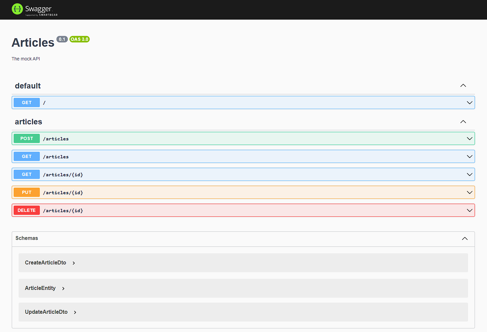

# Guide: NestJS + prisma + SQLite database
---

## Table of Contents
- [Description](#description)
- [Structure](#structure)
- [Composition](#composition)
- [Building](#building)
- [Usage](#usage)
- [Running setup](#running-setup)

### Description
In this documentation is described the way how to set up a mock server and mock database for API testing. It will be get as a result a mock server, mock database, swagger API documentation.
* [tests](https://github.com/Luxe-Quality/NestJS_prisma_SQLite.git) `repository - mock-server`

### Structure

```console
  ├───dist
  │   └───*
  ├───node_modules
  │   └───*
  ├───prisma
  │   ├───migrations
  │   │   └───*
  │   │   └───*.db
  ├───src
  │   └───*
  └───test
      └───*.spec.ts

  - .env
  - .eslintrc.ts
  - .gitignore
  - prettierrc
  - nest-cli.json
  - package-lock.json
  - package.json
  - README.md
  - tsconfig.build.json
  - tsconfig.json
```

- "dist" - is a folder with files converted to .js format and are used for running the mock-server
- "node_modules" is a folder containing node.js modules needed to run tests
- "prisma" is a folder containing migrations files, mock database and scheme of the database.
- "src" is a folder containing all the entities of the project, controller, module, and service files.
- "test" is a folder containing all the existing tests
- ".env" is a file where are variables which are set up using "secrets variables"
- ".gitignore" is a file containing the names of files and folders that are excluded from uploading to github
- "package.json" is a file containing all the basic data of the project, as well as dependencies necessary to run the project and the test run commands
- "package-lock.json" is a file containing fixed project dependencies for a quick installation
- "README.md" is a file containing a description and brief documentation of the project

### Composition
* [nestjs](https://docs.nestjs.com/) `NestJS`
* [jest](https://jestjs.io/docs/getting-started) `Jest`
* [prisma](https://www.prisma.io/docs/getting-started) `Prisma`
* [swagger](https://swagger.io/) `Swagger`

### Building

**Steps to build the project**

Before building the project, there need to install a [node.js](https://nodejs.org/en/) at least 16 versions and install all the dependencies that are necessary for the full operation of the node.js.

>**WARNING**: It necessary to use only LTS version

*This repository can be used like an example.

1. Install NestJS cli:
```
  npm i -g @nestjs/cli
```
2. Create a new project:
```
  nest new mock-server
```

The mock-server directory will be created, node modules and a few other boilerplate files will be installed, and a src/ directory will be created and populated with several core files.

The structure of src folder:
```
  src
  |-app.controller.spec.ts
  |-app.controller.ts
  |-app.module.ts
  |-app.service.ts
  |-main.ts
```

 - **app.controller.ts**	- a basic controller with a single route.
 - **app.controller.spec.ts**	- the unit tests for the controller.
 - **app.module.ts**	- the root module of the application.
 - **app.service.ts**	- a basic service with a single method.
 - **main.ts**	- the entry file of the application which uses the core function NestFactory to create a Nest application instance.

3. Install [prisma](https://docs.nestjs.com/recipes/prisma#set-the-database-connection):
```
  npm install prisma --save-dev
  npx prisma init
```

4. Setup database path in the .env file:
```
  DATABASE_URL="file:./mock.db"
```

5. Setup datasource in the prisma/schema.prisma file:
```
  datasource db {
  provider = "sqlite"
  url      = env("DATABASE_URL")
}
```
After that it is necessary to create schema model.

6. Run SQL migration:
```
  npx prisma migrate dev --name mock
```

7. Initialize the prisma in the project:
```
  npm install @prisma/client
```

8. Generate a prisma module:
```
  npx nest generate module prisma
```
After changing prisma schema (each time) run the command:
prisma generate.

9. Generate a prisma service:
```
  npx nest generate service prisma
```
The "prisma" folder will be created in the src folder.

10. Install [swagger](https://docs.nestjs.com/openapi/introduction) documentation tool:
```
  npm install --save @nestjs/swagger
```
Edit the src/main.ts file to follow an example in this repository.

11. Install nest resource
```
  npx nest generate resource
```
The "transport layer" should be chosen "REST API"

12. Install validation pipe:
```
  npm install class-validator class-transformer
```

13. Generate a prisma exception filter:
```
  npx nest generate filter prisma-client-exception
```
After that the "prisma-client-exception" folder with files inside the "src" folder is created.

14. Install dotenv library:
```
  npm i dotenv-cli --save-dev
```
Edit all the files from "prisma", "src", "test" folders following the examples of this repository.

>[**VIDEO**](https://www.youtube.com/watch?v=LMjj1_EK4y8) resource of building this project

### Usage

Download the project from the [repository](https://github.com/Luxe-Quality/NestJS_prisma_SQLite.git) and open the project folder in the console. Run the command "npm install" in console. Wait until all modules are installed.

```console
  git clone https://github.com/Luxe-Quality/NestJS_prisma_SQLite.git
```
```console
  npm install
```

### Running setup

There are scripts in the "package.json" file which are directly related to the work of the mock server with a database:

```
    "build": "nest build",
    "format": "prettier --write \"src/**/*.ts\" \"test/**/*.ts\"",
    "start": "nest start",
    "start:dev": "nest start --watch",
    "start:debug": "nest start --debug --watch",
    "start:prod": "node dist/main",
    "prisma:studio": "npx prisma studio",
    "lint": "eslint \"{src,apps,libs,test}/**/*.ts\" --fix",
    "test": "jest",
    "test:watch": "jest --watch",
    "test:cov": "jest --coverage",
    "test:debug": "node --inspect-brk -r tsconfig-paths/register -r ts-node/register node_modules/.bin/jest --runInBand",
    "test:e2e": "dotenv -e .env -- npx prisma migrate reset && dotenv -e .env -- jest --runInBand --config ./test/jest-e2e.json",
```

To run the mock server is used the command in a cli:
```
  npm run start:dev
```

To open a database in browser is used the command:
```
  npm run prisma:studio
```

To open OpenAPI documentation in swagger is used the url in a WEB-browser (after running a mock-server):
```
  http://localhost:3000/api
```


To stop the nest mock server use the "**Ctrl+C**" buttons.

All the existing endpoints are in the articles.controller.ts file.
The main endpoint in this project is /articles (@Controller('articles')). There are used decorators in the NestJS framework (@Controller, @ApiTags, @UseFilters, @Get, @Post, @Body, @Param, @Delete).It helps to structure the code.

To interact with a database can be used Postman, Axios, and other tools.
